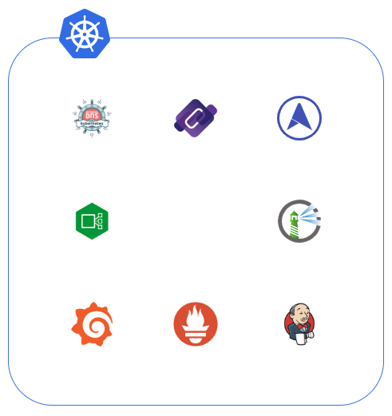
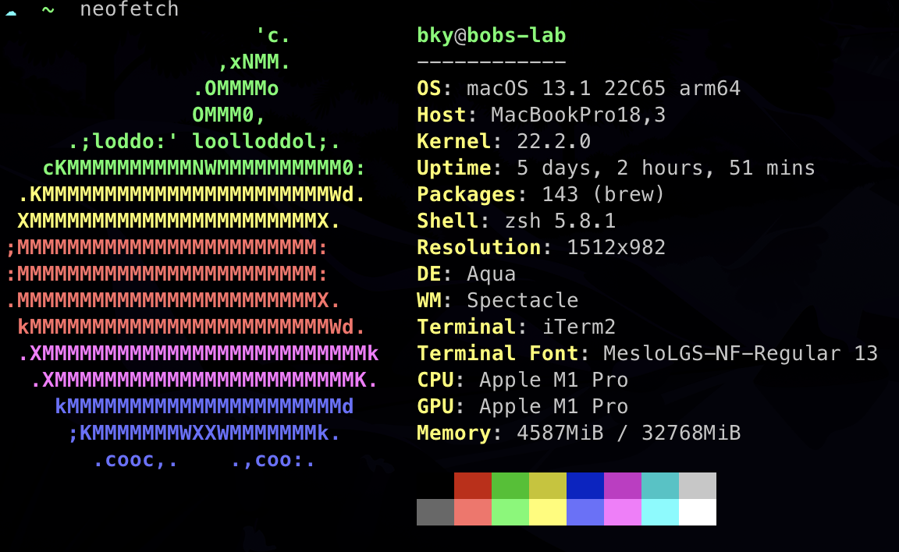

# Bob's KubeOps

## Introduction

- K8S를 활용한 로컬 테스트베드.
- Public Cloud처럼 이런 저런 컴포넌트들을 내 로컬환경에서 직접 구성해보자.

## Features

- 아래와 같은것들 설치됨. (아직 k8s 클러스터까지 자동설치는 아님)
  
- Construction
  - Networking
    - MetalLB
    - IngressNginxController
    - CoreDNS
    - ExternalDNS
  - Monitoring
    - Grafana
    - Prometheus
  - CI/CD
    - Jenkins
    - ArgoCD
  - Registry
    - Harbor

## Environment

- Machine

  

- K8S는 `Docker Desktop`을 이용하여 구동(v1.25.0)

## Installation

1. `Docker Desktop`에서 Kubernetes를 활성화한다.
2. 아래 명령어를 통해 설치한다.

    ```Bash
    # Project Root에서
    cp .npmrc.example .npmrc
    pnpm install

    # ifconfig alias
    pnpm config:network

    # chart/manifest 업데이트
    pnpm synth

    # 배포!
    pnpm deploy:all

    # 아마 MetalLB IPAddressPool 제대로 안만들어졌을거임
    # 다시 pnpm deploy:all 하거나 IpAddressPool만 다시 만든다
    ```
